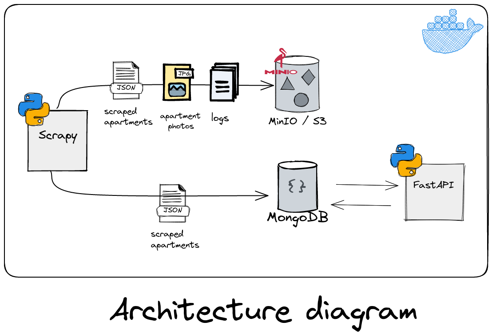
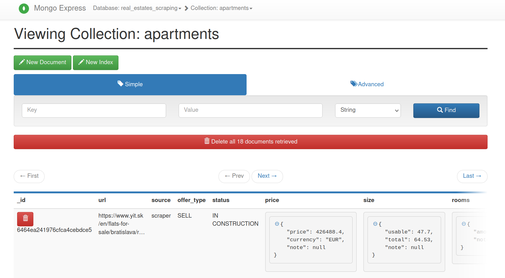
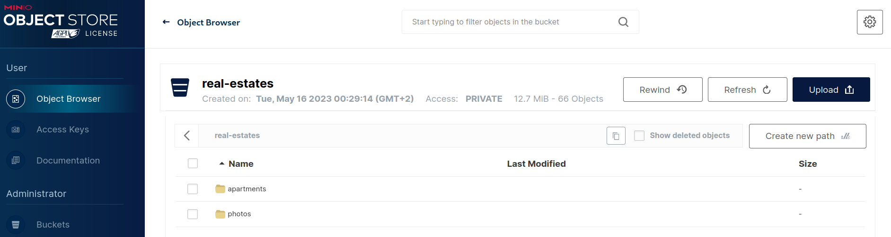

# Web scraping & API proof-of-concept

Job candidate homework on real estate web scraping topic.

Modelling/representing real estate data in backend, scraping, cleaning and serving them through the REST API.

## Homework requirements

*DISCLAIMER: Some decisions in these project don't reflect my point of view on design, but still comply with homework requirements:*

- scraper scrapes given website(s) (which may have dynamic content with JS)
- models/schemas should be designed in a way they can cover different heterogeneous systems
- scraper runs should be repeatable, scraper may be launched more than once per day (in that case data should be overwritten)
- data should be stored in database/storage with granularity of one day
- scraped data should be available through REST API
- API server shouldn't be read-only, but CRUD, so data may come to database through API as well

# Designing & modelling

## Architecture

For scraping `scrapy` framework was chosen as it has all batteries included.

Schemas/models representing real estates/apartments are implemented using `pydantic`, so they have parsing&validation
out-of-the-box.

For API the choice was done for `FastAPI` which has first-class support for pydantic and also has a lot of batteries included, like openapi docs viewer.

"Snapshot" requirement is implemented using `S3`-like object storage (`MinIO`), so each day there are separate jsons
which may be rewritten on repeated scraper execution. Object storage doesn't care about redundancy in this manner, so
each day JSON may have duplicates.

As for database, NoSQL is my personal preference for such situations, `MongoDB` is quite nice for JSON data,
is easily scalable, has good suport for geospatial queries etc. Scraper does care (TODO) about duplicates when saving to db is done.

Project is kind of monorepo. Talking about using it in production, I'd make a lib from `shared/` to be installable using pip.
API could be run as a container, similarly to Mongo and Minio. Scraper can/should be launched manually or using some kind of planner,
maybe cron, maybe K8S cronjob, maybe something like Apache airflow.



# Development / Installation / Usage

## Installation

```shell
python3 -m venv .venv
source .venv/bin/activate
pip install pip-tools pre-commit
pip-sync requirements-dev.txt
pre-commit install
```

## Running

Check and update `.env` to your liking.

Run MinIO and MongoDB in background: `docker-compose up -d`

Run API (todo docker): `uvicorn --reload --reload-dir api api:app`

API is available at http://localhost:8000 and OpenAPI docs are available at http://localhost:8000/docs

Run scraper: `scrapy run`

Results can be checked in Mongo UI at http://localhost:8081 and in MinIO at http://localhost:9001 (credentials are located in `.env`)




## Linting

Format using `black .` and `isort .`

```shell
pre-commit run -a
# or manually
ruff .
mypy .
```

## Testing

```shell
pytest
```

## Locking dependencies

```shell
pip-compile --no-emit-index-url --output-file=requirements.txt --resolver=backtracking pyproject.toml
pip-compile --all-extras --no-emit-index-url --output-file=requirements-dev.txt --resolver=backtracking pyproject.toml
```

For repinning `rm requirements.txt requirements-dev.txt && pip-compile ...`

## TODO

- dockerize api
- more unit tests, integration tests
- even better docs
- PUT route in api/ for update/replacement
- duplicates checker in scraper pipeline
- ensure photos are saved only once, when apartment is saved to mongo
- snippets: loading data from mongo and casting jsons into Apartment pydantic model
- maybe jupyter notebook with geo map etc
